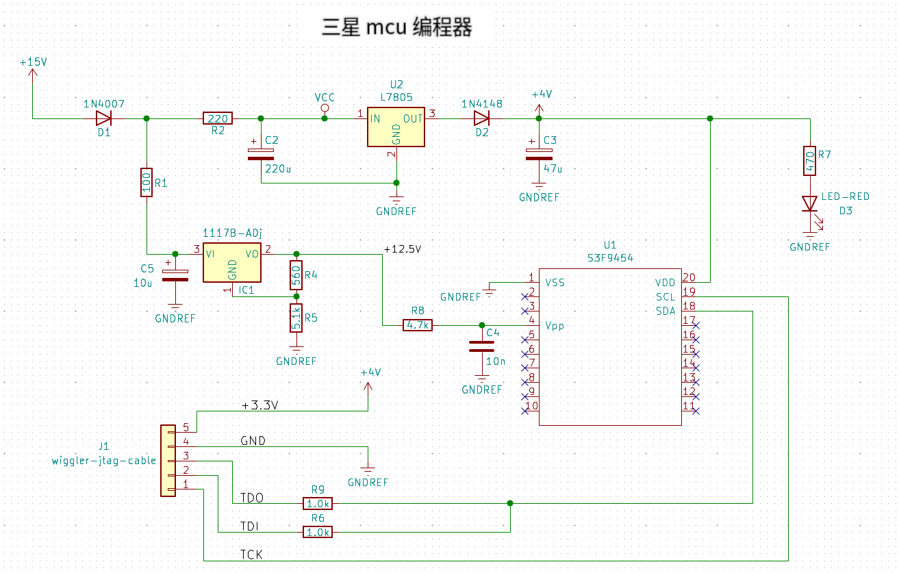
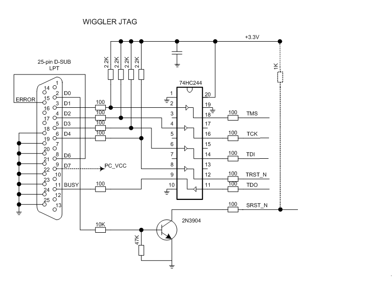
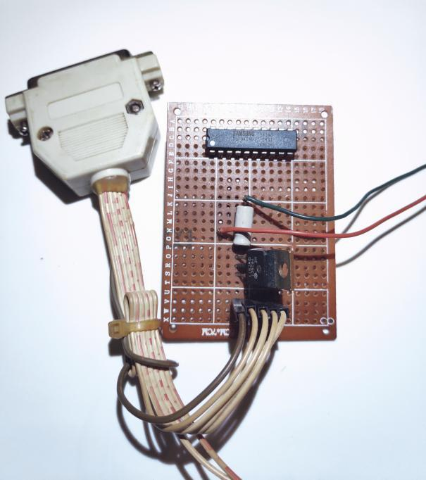
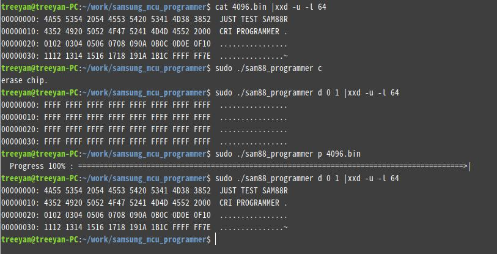

# The programmer for samsung mcu/sam88rcri S3F9454
 
* samsung sam88 core系列mcu编程器
* 这里使用LPT wiggler jtag来编程，运行在linux并且需要有打印机并口。原项目是三星mcu脱机编程器，理论支持sam88 core系列mtp mcu，但这里只有s3f9454
* samsung mcu编程时序[源地址][sam-v1-programmer_link]

#
**电路图**
> 

#

#

**LPT wiggler jtag 电路图** [更多][wiggler-url]

**实物**

#

**编程**

#

**注意**
未测试s3f9454以外其他型号, 请自行效验编程数据是否正确

 7/16/2024 重庆 

#

[sam-v1-programmer_link]:    <https://download.csdn.net/download/nizhenyuchina/9511329>
[wiggler-url]: <https://openwrt.org/docs/techref/hardware/port.jtag.cable.buffered>